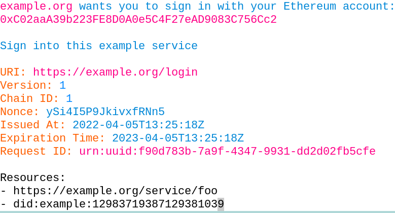
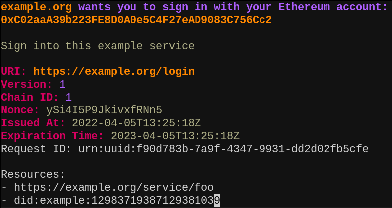

# siwe.vim

Syntax highlighting of [EIP-4361: Sign-In with Ethereum (SIWE)][EIP-4361] messages in [Vim][].

## Install

```
$ git clone https://github.com/spruceid/siwe.vim ~/.vim/pack/plugins/start/siwe.vim
```

## Screenshots


*[example.siwe](./example.siwe) in [summerfruit256][] colorscheme*


*[example.siwe](./example.siwe) in [molokai][] colorscheme*

## License

siwe.vim is released under the terms of either/both the MIT license and the
Apache License (Version 2.0), at your option. See [LICENSE-APACHE](./LICENSE-APACHE) and
[LICENSE-MIT](./LICENSE-MIT) for details.

[EIP-4361]: https://eips.ethereum.org/EIPS/eip-4361
[Vim]: https://www.vim.org/
[summerfruit256]: https://www.vim.org/scripts/script.php?script_id=2577
[molokai]: https://github.com/tomasr/molokai
